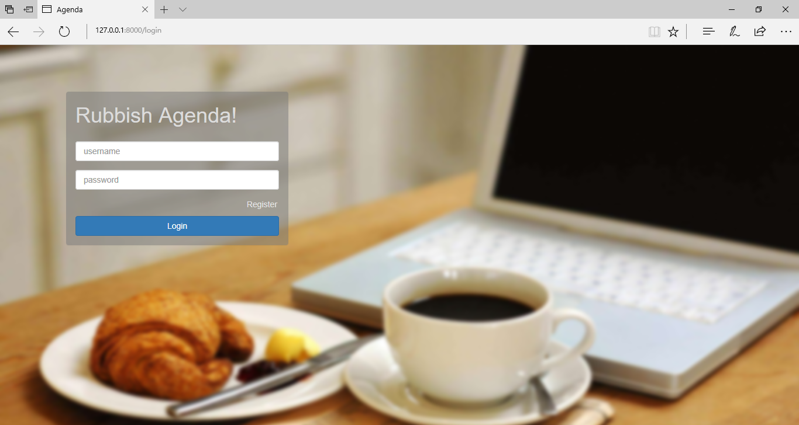

# Agenda

2017 中山大学初级实训agenda。

* **cpp**： 阶段一二基础代码，c++11标准。
* **web**： 阶段三拓展部分，选择web应用扩展。后端Django，前端Bootstrap + jQuery。数据库Sqlite，密码存储加密采用md5算法。

----

## 运行：

### 1. cpp：

g++-4.8 -std=c++11

进入cpp目录linux终端输入make即可，清除编译后的文件输入make clean

---

### 2. web端测试环境：

Python3.5 + Django v1.11.1 + web浏览器

进入 ./web/，输入命令：
**python manage.py runserver**

打开浏览器输入url即可
**http://127.0.0.1:8000/**

**登录界面**：

**所有user**：（感谢注册账号的陌生sysu小伙伴们）

**会议详情**：

